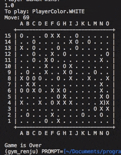

# Gym Renju

Gym-renju is an Renju game simulating environment for Open AI Gym.
The game  is played mainly 15x15 sized board, and 2 players (Black and White) put a stone on the board alternatively.<br>
The player will win the game when he/she make a 5 not breaking stones horizontally, vertically, or diagonally.
The detail rule is a little bit complexed, so please refer to the link below if you want to know it.<br>
https://en.wikipedia.org/wiki/Renju <br>

[](https://github.com/aratakokubun/cursor-hijack/)

Also, I have to note that some of the detail rules is not implemented. Please refer to ## To be implemented to know it.

## Dependencies

### Product Dependencies

* gym (https://github.com/openai/gym)

### Test Dependencies

* pytest (https://github.com/pytest-dev/pytest)
* parameterized

## Installation

```shell
pip install gym-renju
```

## Quick Example
See src in [sample.py](https://github.com/aratakokubun/gym_renju/blob/master/sample/sample.py)

'''sample.py
# Imports
import gym
import time
# Change import on installed on pip
import sys, os
sys.path.append(os.path.join(os.path.dirname(__file__), ".."))
import gym_renju
env = gym.make('Renju19x19-v0') # default 'beginner' level opponent policy

env.reset()
env.render()

# Play a game
env.reset()
for _ in range(225):
    action = env.action_space.sample() # sample without replacement
    observation, reward, done, info = env.step(action)
    env.render()
    if done:
        print ("Game is Over")
        break
'''

## Test

```shell
py.test -v
```

## To be implementated

* Cases of 'Not San San'. This is the case that a player create 'San San' but he/she will not be able to create a 'Yon' on either of 'San' because the action to create 'Yon' is not allowed by other rules (ex. 'Yon Yon').
* Add envs and AI policies.